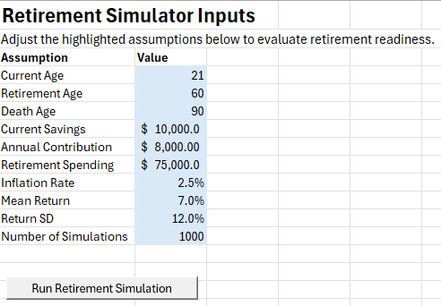
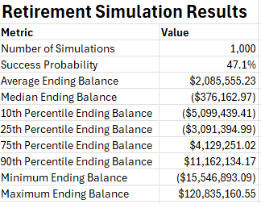
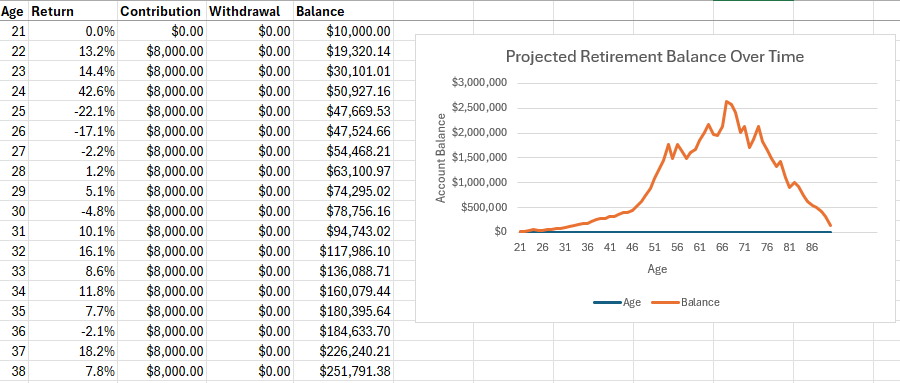

# Retirement Readiness Monte Carlo Simulator

## Project Overview

After opening and beginning to contribute my own Roth IRA, I became interested in how different saving habits, investment returns, and retirement assumptions could affect long-term financial outcomes. Wanting to apply my actuarial and statistical programming skills to a topic that interested me, I developed this retirement planning application.

This project combines R, Excel, and VBA to perform Monte Carlo simulations of retirement portfolios under thousands of possible market scenarios. Users can modify retirement assumptions directly in Excel and run the simulation with a single button, automatically generating updated projections, summary statistics, and visualizations.

Beyond strengthening my programming and actuarial modeling skills, I wanted to build a tool that I could continue using and expanding over time. I plan to continue expanding the simulator as my knowledge of investing and retirement planning grows, creating a practical application that helps me better understand the long-term impact of financial decisions made early in life.

## Key Skills Demonstrated

- Monte Carlo simulation
- Statistical modeling
- R programming
- Excel automation
- VBA development
- Financial modeling
- Data visualization
  
## Features

- Built an interactive Excel interface for user-defined retirement assumptions
- Developed a Monte Carlo simulation engine in R to model thousands of retirement outcomes
- Automated communication between Excel and R using VBA
- Calculated retirement success probabilities and summary portfolio statistics
- Generated year-by-year retirement balance projections
- Created dynamic visualizations of projected retirement balances
- Implemented input validation to prevent invalid simulations

## Technologies Used

Primary Languages: R, VBA

Tools: Microsoft Excel

Methods: Monte Carlo Simulation, Statistical Modeling

## How It Works

1. The user enters retirement assumptions in Excel.
2. VBA validates the inputs.
3. VBA exports the assumptions to a CSV file.
4. R imports the assumptions and performs the Monte Carlo simulation.
5. Thousands of retirement scenarios are simulated using randomly generated annual investment returns.
6. Summary statistics and an annual projection are written to output files.
7. VBA imports the results back into Excel and updates the Results and Projection worksheets.

## Model Assumptions

- Annual investment returns follow a normal distribution.
- Contributions are made at the end of each working year.
- Retirement withdrawals increase annually with inflation.
- Annual investment returns are assumed to be independent.
- A successful simulation is defined as maintaining a positive account balance throughout retirement.

## Project Structure

Retirement-Monte-Carlo-Simulator/

  Excel/
  
    Retirement_Simulator_Final.xlsm

  R/
  
    monte_carlo_simulation.R
    
    load_assumptions.R
    
    visualizations.R

  Images/
  
    inputs.png
    
    results.png
    
    projection.png

  README.md

## Screenshots

### Inputs

Users can modify retirement assumptions directly in Excel before running the simulation.

### Results

The application reports retirement success probability along with summary statistics for ending retirement balances.

### Projection

A single projection illustrates a potential retirement account balance based on one simulated result.

## Future Improvements

- Support additional withdrawal strategies
- Allow user-defined investment allocations that can vary year to year
- Model taxes and Social Security income
- Include historical return simulations
- Add sensitivity analysis and additional charts
- Add ability to contribute at different times throughout each year

This project was intentionally designed to be modular, making it straightforward to incorporate additional retirement planning assumptions and investment models as it evolves.

## Author

Eva Peters

Bachelor of Science in Statistics (Actuarial Science Concentration)

University of Wisconsin–La Crosse

